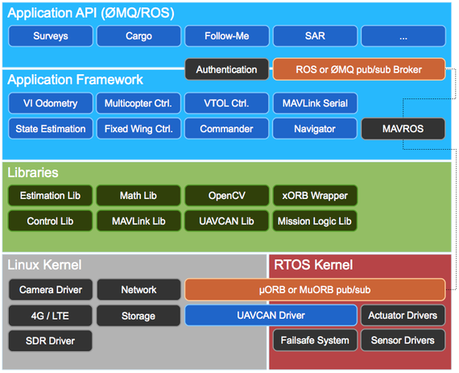
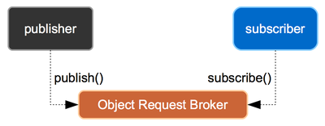
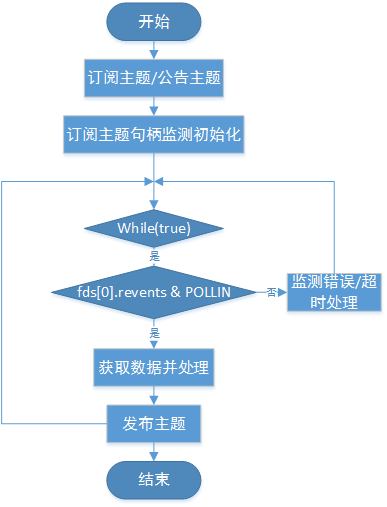

# 1 简介
## 1.1 PX4/Pixhawk的软件体系结构
PX4/Pixhawk的软件体系结构主要被分为四个层次，这可以让我们更好的理解PX4/Pixhawk的软件架构和运作：

* 应用程序的API：这个接口提供给应用程序开发人员，此API旨在尽可能的精简、扁平及隐藏其复杂性。
* 应用程序框架: 这是为操作基础飞行控制的默认程序集（节点）。
* 库: 这一层包含了所有的系统库和基本交通控制的函数。
* 操作系统: 最后一层提供硬件驱动程序，网络，UAVCAN和故障安全系统。

  
* uORB(Micro Object Request Broker,微对象请求代理器)是PX4/Pixhawk系统中非常重要且关键的一个模块，它肩负了整个系统的数据传输任务，所有的传感器数据、GPS、PPM信号等都要从芯片获取后通过uORB进行传输到各个模块进行计算处理。实际上uORB是一套跨「进程」 的IPC通讯模块。在Pixhawk中， 所有的功能被独立以进程模块为单位进行实现并工作。而进程间的数据交互就由为重要，必须要能够符合实时、有序的特点。 

* Pixhawk使用的是NuttX实时ARM系统，uORB实际上是多个进程打开同一个设备文件，进程间通过此文件节点进行数据交互和共享。进程通过命名的「总线」交换的消息称之为「主题」(topic)，在Pixhawk 中，一个主题仅包含一种消息类型，通俗点就是数据类型。每个进程可以「订阅」或者「发布」主题，可以存在多个发布者，或者一个进程可以订阅多个主题，但是一条总线上始终只有一条消息。

## 1.2 PX4/Pixhawk应用程序框架


* 应用层中操作基础飞行的应用之间都是隔离的，这样提供了一种安保模式，以确保基础操作独立的高级别系统状态的稳定性。而沟通它们的就是uORB。

# 2 uORB文件说明

## 2.1 uORB文件／目录说明

文件名               | 说明
--------------------|-----------
ORBMap.hpp          | 对象请求器节点链表管理（驱动节点）
ORBSet.hpp          | 对象请求器节点管理（非驱动节点)
Publication.cpp     | 在不同的发布中遍历使用  
Publication.hpp     | 在不同的发布中遍历使用 
Subscription.cpp    | 在不同的订阅中遍历使用 
Subscription.hpp    | 在不同的订阅中遍历使用
uORB.cpp            | uORB实现
uORB.h              | uORB头文件
uORBCommon.hpp      | uORB公共部分变量定义实现
uORBCommunicator.hpp| 远程订阅的接口实现，实现了对不同的通信通     道管理，如添加/移除订阅者，可以基于TCP/IP或fastRPC;传递给通信链路的实现，以提供在信道上接收消息的回调。 
uORBDevices.cpp     | 节点操作，close,open,read,write 
uORBDevices.hpp     |
uORBMain.cpp        | uORB入口
uORBManager.cpp     | uORB功能函数实现
uORBManager.hpp     | uORB功能函数实现头文件 
uORBTopics.h        | 系统通用接口定义的标准主题,比如电池电量转态、GPS的位置参数等
uORBUtils.cpp       | 
uORBUtils.hpp       |


# 3 常用函数功能解析
* `int poll(struct pollfd fds[], nfds_t nfds, int timeout)`

 ```
功能：监控文件描述符（多个）；
说明：timemout=0,poll()函数立即返回而不阻塞；timeout=INFTIM(-1),poll()会一直阻塞下去，直到检测到return > 0；
参数：
    fds:struct pollfd结构类型的数组；
    nfds:用于标记数组fds中的结构体元素的总数量；
    timeout:是poll函数调用阻塞的时间，单位：毫秒；
返回值：
    >0：数组fds中准备好读、写或出错状态的那些socket描述符的总数量；
    ==0:poll()函数会阻塞timeout所指定的毫秒时间长度之后返回;
    -1:poll函数调用失败；同时会自动设置全局变量errno；
```

* `int orb_subscribe(const struct orb_metadata *meta)`

 ```
 功能：订阅主题（topic）;
 说明：即使订阅的主题没有被公告，但是也能订阅成功；但是在这种情况下却得不到数据，直到主题被公告；
 参数：
 meta：uORB元对象，可以认为是主题id，一般是通过ORB_ID（主题名）来赋值；
 返回值：
 错误则返回ERROR；成功则返回一个可以读取数据、更新话题的句柄；如果订阅的主题没有定义或声明则会返回-1，然后会将errno赋值为ENOENT
 eg：
 int fd = orb_subscribe(ORB_ID(topicName));
 ```
 
* `int orb_copy(const struct orb_metadata *meta, int handle, void *buffer)`

 ```
 功能：从订阅的主题中获取数据并将数据保存到buffer中
 参数：
 meta:uORB元对象，可以认为是主题id，一般是通过ORB_ID(主题名)来赋值；
 handle:订阅主题返回的句柄；
 buffer:从主题中返回的句柄；
 返回值：
 返回OK表示获取数据成功，错误返回ERROR;否则则有根据的去设置errno;
 eg:
 struct sensor_combined_s raw;
 orb_copy(ORB_ID(sensor_combined), sensor_sub_fd, &raw);
 ```
 
* `orb_advert_t orb_advertise(const struct orb_metadata *meta, const void *data)`

 ```
 功能：公告发布者的主题；
 说明：在发布主题之前是必须的；否则订阅者虽然能订阅，但是得不到数据；
 参数：
 meta:uORB元对象，可以认为是主题id，一般是通过ORB_ID(主题名)来赋值；
 data:指向一个已被初始化，发布者要发布的数据存储变凉的指针；
 返回值：
 错误则返回ERROR;成功则反悔一个可以发布主题的句柄；如果待发布的主题没有定义或声明则会返回-1，然互殴会将errno赋值为ENOENT；
 eg:
 struct vehicle_attitude_s att;
 memset(&att, 0, sizeof(att));
 int att_pub_fd = orb_advertise(ORB_ID(vehicle_attotude), &att);
 ```
 
* `int orb_publish(const struct orb_metadata *meta, orb_advert_t handle, const void *data)`

 ```
 功能：发布新数据到主题；
 参数：
 meta:uORB元对象，可以认为是主题id，一般是通过ORB_ID(主题名)来赋值；
 handle:orb_advertise函数返回的句柄；
 data:指向待发布数据的指针；
 返回值：
 OK表示成功；错误返回ERROR；否则则有根据的去设置errno；
 eg:
 orb_publish(ORB_ID(vehicle_attitude), att_pub_fd, &att);
 ```
 
* `int orb_set_interval(int handle, unsigned interval)`

 ```
 功能：设置订阅的最小时间间隔；
 说明：如果设置了，则在这间隔内发布的数据将订阅不到；需要注意的是，设置后，第一次的数据订阅还是由起始设置的频率来获取；
 参数：
 handle:orb_subscribe函数返回的句柄；
 interval:间隔时间，单位ms;
 返回值：OK表示成功；错误返回ERROR；否则则有根据的去设置errno；
 eg:
 orb_set_interval(sensor_sub_fd, 100);
 ```
 
* `orb_advert_t orb_advertise_multi(const struct orb_metadata *meta, const void *data, int *instance, int priority)`

 ```
 功能：设备／驱动的多个实例实现公告，利用次函数可以注册多个类似的驱动程序；
 说明：例如在飞行器中有多个相同的传感器，那她们的数据类型则类似，不必要注册几个不同的话题；
 参数：
 meta:uORB元对象，可以认为是主题的id，一般是通过ORB_ID(主题名)来赋值；
 instance:整型指针，指向实例的ID(从0开始)；
 priority:实例的优先级。如果用户订阅多个实例，优先级的设定可以使用户使用优先级高的最优数据源；
 返回值：
 错误则返回ERROR;成功则返回一个可以发布主题的句柄；如果待发布的主题没有定义或声明则会返回-1，然后会讲errno赋值为ENOENT;
 eg:
 struct orb_test t;
 t.val = 0;
 int instance0;
 orb_advert_t pfd0 = orb_advertise_multi(ORB_ID(orb_multitest), &t, &instance0, ORB_PRIO_MAX);
 ```
 
* `int orb_subscribe_multi(const struct orb_metadata *meta, unsigned instance)`

 ```
 功能：订阅主题（topic）;
 说明：通过实例的ID索引来确定是主题的哪个实例；
 参数：
 meta:uORB元对象，可以认为是主题id，一般是通过ORB_ID(主题名)来赋值；
 instance:主题实例ID;实例ID=0与orb_subscribe()实现相同；
 返回值：
 错误则返回ERROR;成功则返回一个可以读取数据、更新话题的句柄；如果待订阅的主题没有定义或声明则会返回-1,然后会将errno赋值为ENOENT;
 eg:
 int sfd1 = orb_subscribe_multi(ORB_ID(orb_multitest), 1);
 ```

* `int orb_unsubscribe(int handle)`
 
 ```
 功能：取消订阅主题；
 参数：
 handle:主题句柄；
 返回值：
 OK表示成功；错误返回ERROR;否则则有根据的去设置errno；
 eg:
 ret = orb_unsubscribe(handle);
 ```
 
* `int orb_check(int handle, bool *updated)`

 ```
 功能：订阅者可以用来检查一个主题在发布者上一次更新数据后，有没有订阅者用过ob_copy来接收、处理过；
 说明：如果主题在被公告前就有人订阅，那么这个API将返回“not-updated”直到主题被公告。可以不用poll，只用这个函数实现数据的获取。
 参数：
 handle:主题句柄；
 updated:如果当最后一次更新的数据被获取了，检测到并设置updated为ture；
 返回值：
 OK表示检测成功；错误返回ERROR;否则则有根据的去设置errno；
 eg:
 if (PX4_OK != orb_check(sfd, &updated))
     return printf("check(1) failed");
 if (updated)
     return printf("spurious updated flag");
 
 //or
 
 bool updated;
 struct random_integer_data rd;
 //检测上一次读取这个主题后，该主题是否更新
 orb_check(topic_handle, &updated);
 if(updated){
     //对更新后的数据做一个本地拷贝
     orb_copy(ORB_ID(random_integer), topic_handle, &rd);
     printf("Random integer is now %d\n", rd.r);
 }
 ```
 
* `int orb_stat(int handle, uint64_t *time)`

 ```
 功能：订阅者可以用来检查一个主题最后的发布时间
 参数：
 handle:主题句柄；
 time:存放主题最后发布的时间；0表示该主题没有发布或公告
 返回值：
 OK表示检测成功；错误返回ERROR;否则则有根据的去设置errno；
 eg:
 ret = orb_stat(handle, time);
 ```
 
* `int orb_exists(const struct orb_metadata *meta, int instance)`

 ```
 功能：检测一个主题是否存在；
 参数：
 meta:uORB元对象，可以认为是主题id，一般是通过ORB_ID(主题名)来赋值；
 instance:ORB实例ID;
 返回值：
 OK表示检测成功；错误返回ERROR;否则则有根据的去设置errno;
 eg:
 ret = orb_exists(ORB_ID(vehicle_attitude), 0);
 ``` 
 
* `int orb_priority(int handle, int *priority)`

 ```
 功能：获取主题优先级别；
 参数：
 handle:主题句柄；
 priority:存放获取的优先级别；
 返回值：
 OK表示检测成功；错误返回ERROR;否则则有根据的去设置errno；
 eg:
 ret = orb_priority(handle, &priority);
 ```
 
# 4 例程
# 4.1 例程前准备工作
* archives已编译完成（注：**现已改为cmake编译系统，不再需要编译archives**）
* 添加一个新的模块
  * 在Firmware/sr/modules中添加一个新的文件夹，命名为px4\_simple\_app
  * 在px4_simple_app文件夹中创建module.mk文件，并输入以下内容：
     * MODULE_COMMAND = px4\_simple\_app
     * SRC = px4\_simple\_app.c
  * 在px4\_simple\_app文件夹中创建px4\_simple\_app.c文件
  
```  
/**
 * @file px4_simple_app.c
 * Minimal application example for PX4 autopilot.
 */

#include <nuttx/config.h>
#include <stdio.h>
#include <errno.h>

__EXPORT int px4_simple_app_main(int argc, char *argv[]);

int px4_simple_app_main(int argc, char *argv[])
{
    printf("Hello Sky!\n");
    return OK;
}
```

* 注册新添加的应用到NuttShell中，并编译上传
   * Firmware/makefiles/config\_px4fmu-v2\_default.mk文件中添加如下内容：
      * MODULES += modules/px4\_simple\_app
   * 编译
      * make = clean
      * make px4fmu-v2\_default
   * 上传到板子中
      * make px4fmu-v2\_defalut upload
* 在QGC中的Terminal(终端)中运行心应用
   * nsh > px4\_simple\_app
   
**接下来的代码修改均基于此应用**
## 4.2 订阅主题
**sensor\_combined**主题是官方提供的通用接口标准主题

```
/**
 * @file px4_simple_app.c
 * Minimal application example for PX4 autopilot
 */
 
#include <nuttx/config.h>
#include <unistd.h>
#include <stdio.h>
#include <poll.h>

#include <uORB/uORB.h>
#include <uORB/topics/sensor_combined.h>

__EXPORT int px4_simple_main(int argc, char *argv[]);

int px4_simple_app_main(int argc, char *argv[])
{
    printf("Hello Sky!\n");
    
    /*订阅sensor_combined主题*/
    int sensor_sub_fd = orb_subscribe(ORB_ID(sensor_combined));
    
    /*一个应用可以等待多个主题，在这里只等待一个主题*/
    struct pollfd fds[] = {
        {.fd = sensor_sub_fd, .event = POLLIN },
        /* 这里可以添加更多的文件描述符；
         * {.fd = other_sub_fd, .event = POLLIN},
         */
    };
    
    int error_counter = 0;
    
    while(true){
        /*poll函数调用阻塞的时间为1s*/
        int poll_ret = poll(fds, 1, 1000);
        
        /*处理poll返回的结果*/
        if (poll_ret == 0) {
            /*这表示时间溢出了，在1s内没有获取到发布者的数据*/
            printf("[px4_simple_app] Got no data within a second\n");
        }
        else if (poll_ret < 0){
            /*出现问题*/
            if (error_counter < 10 || error_counter % 50 == 0){
                /*use a counter to prevent flooding(and slowing us down)*/
                printf("[px4_simple_app] ERROR return value from poll(): %d\n", poll_ret);
            }
            error_counter ++;
        }
        else{
            if (fds[0].revents & POLLIN) {
                /*从文件描述符中获取订阅的数据*/
                struct sensor_combined_s raw;
                /* copy snesors raw data into local buffer*/
                orb_copy(ORB_ID(sensor_combined), sensor_sub_fd, &raw);
                printf("[px4_simple_app] Accelerometer:\t%8.4f\t%8.4f\t%8.4f\n", 
                    (double)raw.accelerometer_m_s2[0],
                    (double)raw.accelerometer_m_s2[1],
                    (double)raw.accelerometer_m_s2[2]);
            }
            /* 如果有更多的文件描述符，可以这样：
             * if (fds[1..n].revents & POLLIN) {}
             */
        }
    }
    
    return 0;
}
```

```
测试需要在QGC终端启动uORB和初始化该传感器，最后运行应用：
    nsh > uorb start
    nsh > sh /etc/init.d/rc.sensors
    nsh > px4_simple_app &
```
## 4.3 订阅和发布主题
**sensor_combined**主题是官方提供的通用接口标准主题。  
**vehicle_attitude**主题是官方提供的通用接口标准主题。

程序流程图如下：  



```
/**
 * @file px_simple_app.c
 * Minimal application example for PX4 autopilot
 */

#include <nuttx/config.h>
#include <unistd.h>
#include <stdio.h>
#include <poll.h>

#include <uORB/uORB.h>
#include <uORB/topics/sensor_combined.h>
#include <uORB/topics/vehicle_attitude.h>

__EXPORT int px4_simple_app_main(int argc, char *argv[]);

int px4_simple_app_main(int argc, char *argv[])
{
    printf("Hello Sky!\n");
    
    /*订阅sensor_combined主题*/
    int sensor_sub_fd = orb_subscribe(ORB_ID(sensor_combined));
    orb_set_interval(sensor_sub_fd, 1000);
    
    /*公告attitude主题*/
    struct vehicle_attitude_s att;
    memset(&att, 0, sizeof(att));
    int att_pub_fd = orb_advertise(ORB_ID(vehicle_attitude), &att);
    
    /*一个应用可以等待多个主题，在这里只等待第一个主题*/
    struct pollfd fds[] = {
        { .fd = sensor_sub_fd,  .events = POLLIN },
        /* there could be more file descriptors here, in the form like:
         * { .fd = other_sub_fd,  .events = POLLIN },
         */
    };
    
    int error_counter = 0;
    
    while (ture) {
        /*wait for sensor update of 1 file descriptor for 1000 ms*/
        int poll_ret = poll(fds, 1, 1000);
        
        /*handle the poll result*/
        if (poll_ret == 0){
            /*this means none of our providers is giving us data*/
            printf("[px4_simple_app] Got no data within a second\n");
        }
        else if (poll_ret < 0){
            /*this is seriously bad - should be an emergency*/
            if (error_counter < 10 || error_counter % 50 == 0){
                /*use a counter to prevent flooding (and slowing us down)*/
                printf("[px4_simple_app] ERROR return value from poll(): %d\n", poll_ret);
            }
            error_counter ++;
        }
        else {
            if (fds[0].revents & POLLIN) {
                /*obtained data for the first file descriptor*/
                struct sensor_combined_s raw;
                /*copy sensors raw data into local buffer*/
                orb_copy(ORB_ID(sensor_combined), sensor_sub_fd, &raw);
                printf("[px4_simple_app] Accelerometer:\t%8.4f\t%8.4f\t%8.4f\n",
                    (double)raw.accelerometer_m_s2[0],
                    (double)raw.accelerometer_m_s2[1],
                    (double)raw.accelerometer_m_s2[2]);
                    
                /*赋值att并且发布这些数据给其它的应用*/
                att.roll = raw.accelerometer_m_s2[0];
                att.pitch = raw.accelerometer_m_s2[1];
                att.yaw = raw.accelerometer_m_s2[2];
                orb_publish(ORB_ID(vehicle_attitude), att_pub_fd, &att);
            }
            /* there could be more file descriptors here, in the form like:
             * if (fds[1..n].revents & POLLIN) {}
             */
        }
    }
    
    return 0；
}
```

## 4.4 创建自己的主题
官方提供的通用接口标准主题都放在了topics文件下了。如果需要定义我们自己的主题，比如我们新添加了超声波传感器，为了将超声波传感器的数据发布出去给其它需要的应用订阅，那么就需要创建我们的主题。

* 主题头文件（mytopic.h）
   * ORB_DECLARE(myTopicName);//声明一个主题
   * 定义一个存放数据的结构体；
* 主题源文件（mytopic.c）
   * ORB_DEFINE(myTopicName);//定义一个主题
   * 初始化发布数据
   * 公告主题
   * 发布主题数据

`mytopic.h`

```
/*声明自定义主题，名字可以自定义，不过最好具有一定的意义，如下为随机产生整数数据*/
ORB_DECLARE(random_integer);

/*定义要发布的数据结构体*/
struct random_integer_data {
    int r;
};
```

`mytopic_publish.c`

```
#include <topic.h>

/*定义主题*/
ORB_DEFINE(random_integer);

/*待发布的主题句柄*/
static int topic_handle;

int init()
{
    /*随机产生一个初始化数据结构体*/
    struct random_integer_data rd = { .r = random(), };
    
    /*公告主题*/
    topic_handle = orb_advertise(ORB_ID(random_integer), &rd);
}

int updata_topic()
{
    /*产生心的数据*/
    struct random_integer_data rd = { .r = random(), };
    
    /*发布主题，更新数据*/
    orb_publish(ORB_ID(random_integer), topic_handle, &rd);
}
```
对于订阅者来说，可参考4.2订阅例程。以下为简单处理例程：
`mytopic_subscriber.c`

```
#include <topic.h>

/*订阅主题的句柄*/
static int topic_handle;

int init()
{
    /*订阅主题*/
    topic_handle = orb_subscribe(ORB_ID(random_integer));
}

void check_topc()
{
    bool upfated;
    struct random_integer_data rd;
    
    /*check to see whether ther topic has updated since the last time we read it*/
    orb_check(topic_handle, &updated);
    
    if (updated) {
        /*make a local copy of the updated data structure*/
        orb_copy(ORB_ID(random_integer), topic_handle, &rd);
        printf("Random integer is now %d\n", rd.r);
    }
}
```
# 5 uORB简单实例
在这一部分，通过编写两个进程（即发布者和订阅者）之间的uORB通信进一步理解uORB过程。

## 5.1 介绍
在本次历程中，发布者负责生成随机数，订阅者通过订阅主题，来获取声称的数据，并打印输出

## 5.2 加入主题定义
* 在Firmware/msg中添加mytopic.msg，在文件里只需声明该主题的成员变量，在编译时，会自动在uORB目录下生成相应的mytopic.h文件，所有的主题头文件都是这样生成的，包括pixhawk系统自带的  

例如：完整的数据结构是这样的

```
struct mytopic_s {
    int32 r;
};
```
则在mytopic.msg文件中只需写入如下内容：

```
int32 r
```
mytopic.msg


* 在该目录下的CMakeLists.txt文件中加入mytopic.msg  

  

编译生成的对应mytopic.h

mytopic.h是代码编译时有系统自动生成

## 5.3 加入发布者进程
* 在Firmware/src/modules目录下新建一个mytopic_test文件夹，并创建cmake文档CMakeLists.txt，模仿其它程序cmake文件的书写方式写入如下内容

```
px4_add_module(
	MODULE modules__mytopic_test
	MAIN mytopic_test
	STACK_MAIN 2000
	SRCS
		mytopic_test.cpp
	DEPENDS
		platforms__common
	)
```


* 在该目录下创建mytopic_test.cpp文件，写入发布者程序代码

```
#include <px4_config.h>
#include <px4_tasks.h>
#include <px4_posix.h>
#include <unistd.h>
#include <stdio.h>
#include <string.h>
#include <stdlib.h>
#include <time.h>

#include <uORB/uORB.h>
#include <uORB/topics/mytopic.h>

static orb_advert_t topic_handle;

/*定义主题*/
constexpr char __orb_mytopic_fields[] = "uint64_t timestamp;uint32_t noutputs;float[16] output;uint8_t[4] _padding0;";
ORB_DEFINE(mytopic, struct mytopic_s, 32, __orb_mytopic_fields);

extern "C" __EXPORT int mytopic_test_main(int argc, char *argv[]);
int mytopic_test_main(int argc, char *argv[])
{
    /*随机产生一个初始化数据结构体*/
    struct mytopic_s rd;
    rd.r = rand() % 100;

    /*公告主题*/
    topic_handle = orb_advertise(ORB_ID(mytopic), &rd);

    srand((unsigned) time(NULL));

    for(int i = 0; i < 360; i ++) {
        /*产生新的数据*/
        rd.r = rand() % 100;
        // PX4_INFO("[mytopic_test] Accelerometer \t%d", rd.r);

        /*发布主题，更新数据*/
        orb_publish(ORB_ID(mytopic), topic_handle, &rd);
        usleep(200000);
    }


    return 0;
}
```


* 在Firmware/cmake/configs/nuttx_px4fmu-v2_default.cmake中加入modules/mytopic_test这样在编译时，就会编译这个程序


## 5.4 加入订阅者进程
这里可以按照上面的方式再添加一个程序，只是代码不同；本例中，我们直接更改Firmware/src/examples中的px4_simple_app代码来实现

* 在px4_simple_app.c文件中直接写入以下代码

```
#include <px4_config.h>
#include <px4_tasks.h>
#include <px4_posix.h>
#include <unistd.h>
#include <stdio.h>
#include <poll.h>
#include <string.h>

#include <uORB/uORB.h>
#include <uORB/topics/mytopic.h>

static int topic_handle;

__EXPORT int px4_simple_app_main(int argc, char *argv[]);

int px4_simple_app_main(int argc, char *argv[])
{
    PX4_INFO("Hello Sky! \nThis is mytopic test!");

    /*订阅mytopic主题*/
    topic_handle = orb_subscribe(ORB_ID(mytopic));
    orb_set_interval(topic_handle, 1000);

    px4_pollfd_struct_t fds[] = {
        { .fd = topic_handle,   .events = POLLIN },
    };

    int error_counter = 0;

    for (int i = 0; i < 5; i++) {
        /*每1s接收1个数据*/
        int poll_ret = px4_poll(fds, 1, 1000);

        if (poll_ret == 0) {
            /*这表示在这1s内没有任何数据被获取到*/
            PX4_ERR("[px4_simple_app] Got no data within a second");

        } else if (poll_ret < 0) {
            /* this is seriously bad - should be an emergency */
            if (error_counter < 10 || error_counter % 50 == 0) {
                /* use a counter to prevent flooding (and slowing us down) */
                PX4_ERR("[px4_simple_app] ERROR return value from poll(): %d"
                       , poll_ret);
            }

            error_counter++;

        } else {

            if (fds[0].revents & POLLIN) {
                struct mytopic_s raw;
                orb_copy(ORB_ID(mytopic), topic_handle, &raw);
                PX4_WARN("[px4_simple_app] Accelerometer:\t%d", raw.r);
            }
        }
    }
    PX4_INFO("exiting");

    return 0;
}
```


* 在Firmware/cmake/configs/nuttx_px4fmu-v2_default.cmake中加入modules/mytopic_test这样在编译时，就会编译这个程序


## 5.5 测试
* 编译固件 `make px4fmu-v2_default`
* 上传固件 `make px4fmu-v2_default upload`
* 进入nuttshell `screen /dev/tty.xx BAUDRATE 8N1`
* 后台运行发布者程序 `mytopic_test &`
* 运行订阅者程序 `px4_simple_app`  
运行结果


# 6 参考资料
[PX4开发指南](http://dev.px4.io)    
[第一个机载应用程序教程](http://www.pixhawk.com/start?id=zh/dev/px4_simple_app)  
[Pixhawk飞控系统之uORB深入解析](http://blog.arm.so/armteg/pixhawk/183-0503.html)  
[pixhawk自学笔记之uorb学习总结](http://blog.csdn.net/xiao2yizhizai/article/details/50684450)  
[PX4/Pixhawk--uORB深入理解和应用](http://blog.csdn.net/FreeApe/article/details/46880637)  
[Pixhawk---在cmake编译方式下新建一个自定义主题](http://blog.csdn.net/xinyu3307/article/details/52195535)  
[Pixhawk---通过串口方式添加一个自定义传感器（超声波为例）](http://blog.csdn.net/freeape/article/details/47837415)  
[pixhawk飞控中添加uORB主题](http://blog.csdn.net/u014666004/article/details/51260392)

   