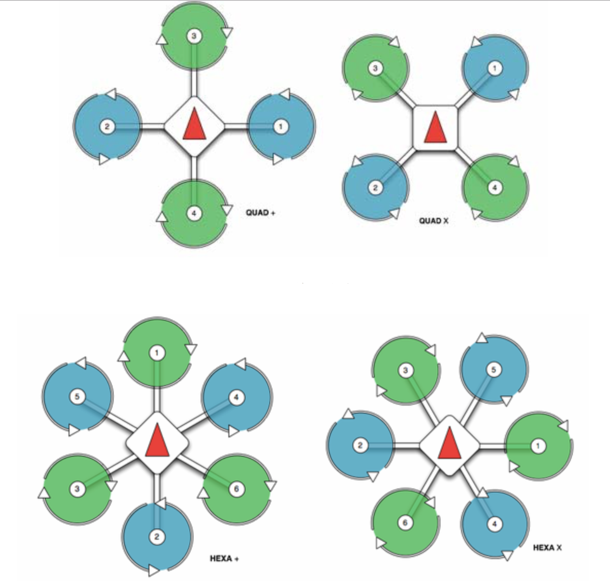
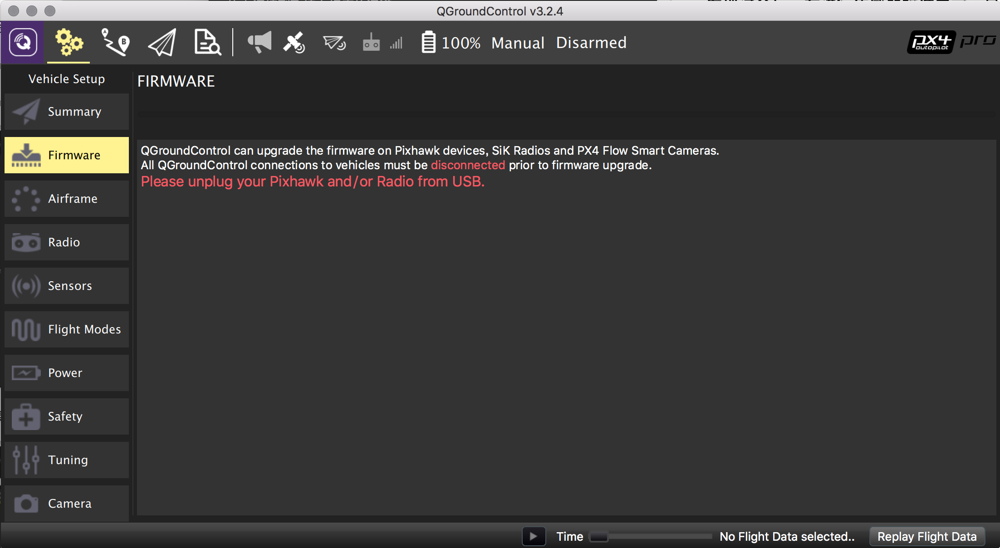

# 四轴无人机组装调参总结(pixhawk飞控固件、QGC地面站)

##### 本篇经验总结基于pixhawk飞控板以及pixhawk原生飞控固件，不是apm飞控。很多人在平常所说的pixhawk飞控实际上是指apm固件，由于本人研究学习的需要，选择的是pixhawk原生固件。pixhawk与apm比较起来，控制更加精准，参数调试也相对要更简单。在代码上，pixhawk比apm的代码要更加规范，这也更便于编程人员的学习。

## 1. 无人机零件
### 基本配件：机架、pixhawk飞控板、电池、电流计、电调、电机、螺旋桨、接收机、遥控器、蜂鸣器、安全按钮
###附加配件：数传、电压回传、GPS、光流传感器等
###机架
```
   我所选用的机架是F450机架，在机架的选择上，根据自己的实际情况  
   选择不同型号的机架。在机架上在F450的机架上已带有BEC供电电路，  
   可以直接把电流计、电调焊接在上面；当然也可以选择使用有T插头或  
   者XT60插的电调，这样需要在机架下板上焊接相应的接头或者购买一  
   个电调分线板，这种方式在以后更换电调的时候会更加的方便。
```


### pixhawk飞控板
```
   pixhawk飞控板中带有罗盘、水平仪、速度计等传感器，有方向的分  
别，飞控板上的箭头标志表示了无人机的前方。在板的尾部，部有有多个  
通道，这里只对用到的通道进行说明。注意这里的通道序号是从右向左的，  
在连接电调时一定要分清所接的通道是否正确。
```


### 电机
```
1 电机KV值:
  ——大KV配小桨,小KV配大桨。
  KV值是每1V的电压下电机每分钟空转的转速,例如KV800,在1V的电压  
  下空转转速是800转每分钟。
     绕线匝数多的,KV值低,最高输出电流小,但扭力大
     绕线匝数少的,KV值高,最高输出电流大,但扭力小
  KV值越小,同等电压下转速越低,扭力越大,可带更大的桨。KV值越大,  
  同等电压下转速越高,扭力越小,只能带小桨。相对的说KV值越小,效率  
  就越高。
2 电机型号:
  ——定子粗的,力气大。
  电机型号,如 2212,3508,4010,这些数字表示电机定子的直径和高度。  
  前面两位是定子直径,后面两位是定子高度,单位是毫米。前两位越大,  
  电机越肥,后两位越大,电机越高。又大又高的电机称为高富帅，力气大,  
  效率高。
3 整机重量,应该小于电机最大动力的 2/5。
  四轴的升力除了把自身抬起来之外还要用一部分力来前迚后退,左右横  
  滚。最关键的还有抗风,一般保留五分之三的升力来做这些动作和抗风,  
  而且电池电压降低后不至于升力不足而炸鸡。
```
### 电池
```
1 电池容量:
  5200mAh,意味着以5.2A电流放电,可以放1小时。当然,我们只是这样  
  理解。实际放电时间,需要参考电池厂家提供的相关技术参数。
2 放电能力:
  30C电池,说的是电池的放电能力。对于30C电池,最大持续放电电流为:  
  电池容量 X 放电 C。
  例如:5200MA,30C电池,则最大的持续电流就是=5.2X30=156A(安  
  培)。
  如果该电池长时间超过156安培以上电流工作,那电池的寿命会变短。对  
  于电池的单片电压,充满电时应为4.15-4.20较合适(3S电池对应12.6  
  V),用后的最低电压为单片3.7以上(3S对应11.1V,切记不要过放，一  
  次过放就可能造成电池永久报废),长期不用的保存电压最好为3.9(3S  
  对应11.7V)。
```
### 经验
```
 经验(供借鉴):
 四轴航拍电机桨搭配推荐:
 3S 电池 1.8KG 以下可用 2216KV800 电机搭配 APC1147 桨。
 3S 电池 2KG 以下可用 2810KV750 电机搭配 APC1238 桨。
 3S 电池 2.5KG 以下可用 2814KV700 电机搭配 APC1340 桨
 4S 电池 2.5KG 以下可用 2814KV600 电机搭配 APC1340 桨
 3110KV650 电机搭配 APC1238 桨
 3508KV580/KV700 电机搭配 DJI1555/APC1540 桨。
 4108KV480/KV600 电机搭配 APC1447/APC1540 桨
 6S 电池,3KG 以下可用 3508KV380 电机搭配 DJI1555 桨
 4108KV380 电机搭配 DJI1555 桨
 4010KV320 电机搭配 DJI1555 桨
```
### 电源模块（电流计）
```
电源模块用于连接电池和飞控板、BEC（即F450机架下板），向飞控以及  
电调供电  
```

### 电调
```
电调全称电子调速器，英文Electronic Speed Control,简称ESC。作  
用是根据飞控的控制信号，将电池的直流输入转变为一定频率的交流输出，  
用于控制电机的转速。    

电调与电机和飞控的连接，一般情况下是这样的：

1、电调的输入线（最粗的红黑线）与电池（BEC电路）连接；

2、电调的输出线（有刷两根、无刷三根）与电机连接；

3、电调的信号线（最细的线）与飞控连接。  
```
### 安全按钮
```
安全按钮用于无人机的解锁，飞控断电后或者手动上锁后，都需要长按安 
全按钮来解锁，再通过遥控器解锁，否则无法起飞。手动上锁时，也是通   
过长按安全按钮来上锁。
```

### 蜂鸣器
```
蜂鸣器本身有比较严重的电磁辐射,使用的时候尽量远离飞控安装,不要直  
接贴在飞控上。
```

### 接收机
```
接收机用于接收遥控器的控制信号并输出到飞控板，pixhawk飞控板所接  
受的是pwm信号，目前有很多接收机都支持pwm信号输出，如果所买的接收  
机不支持pwm信号输出，则需要再接一个ppm编码器。
```
### 遥控器
```
目前市面上常见的有美国手和日本手，个人认为这个根据个人习惯购买，  
这里我使用的是美国手油门。
```

### GPS
```
大多数的GPS都带有罗盘，GPS有两个插头，罗盘线插入I2C口，GPS插入  
GPS口。插入GPS罗盘后，需要重新进行罗盘校准。
```

## 2. 接线图


```
注意这里的电机标号，以及四个电机的旋转方向，根据电机标号，把相连  
的电调接到飞控上相应的通道。
```


## 3. QGroundControl地面站校准调参
### pixhawk飞控固件在校准和参数调节上与apm固件有一点不同，这里pixhawk调参推荐使用QGroundControl。最大的不同是，在pixhawk固件中不用像apm那样做pid参数调节（至少我现在还没发现这个）。在进行传感器校准之前，最好是先把无人机组装好，因为不同的飞机不一样，校准出来的结果也会不同。可以使用数据线连接电脑与无人机，也可使用数传连接。
* 打开地面站，电机齿轮图标，将看到如下界面


```
我这里已经是把所有传感器都校准好了的，如果有没校准的，这里会显  
示红色状态提醒。
```

* 在Firmware里可以更新固件版本，这里可以烧录pixhawk以及apm的固件

* 更新完固件后，就需要进入到Airframe里对无人机机型进行选择，这里可以根据所用的机架型号进行设置

* 机型设置好过后，就需要对遥控器进行校准，在这里点击Calibrate，然后跟着右边的图，拨动摇杆就行

* 接下来，进入Sensors，对陀螺仪、罗盘、加速度计、水平等传感器进行校准。分别在左边选择不同的传感器，多不同传感器尽心校准，只需要跟随指导做就行


 ```
   1. 陀螺仪(Gyroscope)
      将无人机水平放置，开始矫正之后保持不同。
   2. 罗盘(Compass)
      分别将无人机按上下左右前后六个方向防治，当对应的姿态图边框  
      变黄后按地面站指示的箭头方向转动。
   3. 加速度计(Accelerometer)
      同样按照六个方向分别摆置无人机，保持不动就可以。
   4. 水平(Level Horizon)
      在这里，地面站不会给任何图片提示，只需要将无人机放到水平面  
      就行。
 ```
 
* 飞行模式设置，可以选择使用遥控器上的通道来进行飞行模式的切换，这个根据个人操作，自己设置。新手建议是，自稳模式解锁起飞，切定点模式飞行，降落自稳上锁。

* 电源模块的设置，***这里非常重要，这会影响到飞控对电量的监控，进而影响电池使用寿命***


 ```
   1. 单片满电电压
      一般来说，航模电池的单片满电电压都是4.2V，具体参数可以问卖  
      家。
   2. 单片最低电压
      大多数航模电池的最低保留电压都在3.6左右，切记不要过放，一  
      次过放酒会造成永久性损坏。
   3. 分压器
      这里的话，需要根据实际测量来校准，点击Calculate，输入测 
      得的电压值，会自动计算出这个数值
   4. 每1v电压的电流大小
      同样这里需要根据实际测得得数值来自动计算，但是电池的电流大  
      小并不好测，我这里也是参考其他人的数据来大概填写的。
   5. 电调校准
      这里也就是油门行程校准，在做这一步的时候，必须要用数据线连  
      接飞控，最好是把螺旋桨也取下来，再做。点击Calibrate，先  
      拔掉电池、再连上电池，就可自动校准。
 ```
 
* 安全设置，这个地方，根据个人需要进行设置

* 飞行参数设置


 ```
    1. 悬停油门：为的是让油门杆的中间位置是飞机的悬停位置，如果  
       悬停油门低于中间位置则向左滑动，如果高于中间位置则向右滑  
       动。
    2. 手动飞行最低油门：用于设置电机开始旋转时的最低油门，向左  
       滑动会降低油门，如果飞机在下降过程中出现不稳定的情况，则  
       向右滑动。
    3. 横滚角灵敏度：如果需要加快飞机的横滚角响应速度和精度则可  
       将滑块向左滑动，如果飞机出现抖动则向右滑动。
    4. 俯仰角灵敏度：如果需要加快飞机的俯仰角响应速度和精度则可  
       将滑块向左滑动，如果飞机出现抖动则向右滑动。
 ```
 
* 也可在最后一个选项Parameters中进行更复杂的参数修改

